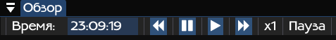

# Интерфейс

## Ввод/вывод
---

Элементы интерфейса пользовательского ввода/вывода задаются из кода модуля. Например, в функции инициализации (<b>init</b>) могут быть заданы элементы интерфейса ввода, а в функции однократной обработки (<b>exec</b>) могут быть заданы элементы интерфейса вывода.

 

<image src="img/interface_io.png">

 

## Управление временем
---

Здесь отображаются время и кнопки управления временем: <b>замедление</b>, <b>ускорение</b>, <b>пауза</b> и <b>возобновление</b>. При включении паузы время останавливается.

 

 

## Загрузка модулей
---

Меню "<b>Модули</b>" -> "<b>Добавить</b>". В этом окне можно выбрать модули (в виде динамических библиотек), которые хочется подключить. Справа виден выбранный порядок, который можно изменять.

 

<image src="img/load_modules.png">

 

## Работа с модулями
---

В выделенном красным цветом выпадающем списке отображаются все загруженные модули. С помощью этого списка можно переключаться между модулями.

 

<image src="img/module_choice.png">

 

<b>Пример</b>: выбран модуль получения информации о суднах. В его инициализации прописано отображение выпадающего списка со всеми суднами и кнопка подтверждения выбора, после нажатия на которую происходит отображение всех данных о выбранном судне в интерфейс вывода.

 

<image src="img/module_io_example.png">

 

## Выгрузка модулей и порядок вызова горячих функций 
---

Меню "<b>Модули</b>" -> "<b>Менеджер модулей</b>". В этом окне можно регулировать порядок вызова горячих функций модулей с помощью нажатия на пиктограммы смещенеия (стрелки <b>вверх</b>/<b>вниз</b>). Здесь же можно выгрузить модули, для чего необходимо нажать на пиктограмму "<b>крест</b>", либо выбрать несколько модулей галочками и нажать на кнопку "<b>Выгрузить выделенное</b>". После проведения этих действий модули выгрузяться, но сохраниться порядок вызова их горячих функций - если их загрузить снова ("<b>Загрузить выделенное</b>"), то порядок будет прежним. Для полной выгрузки и удаления информации о порядке вызова горячих функций необходимо повторно нажать на "<b>крест</b>" или кнопку "<b>Выгрузить выделенное</b>".

 

<image src="img/module_hot_order.png">
